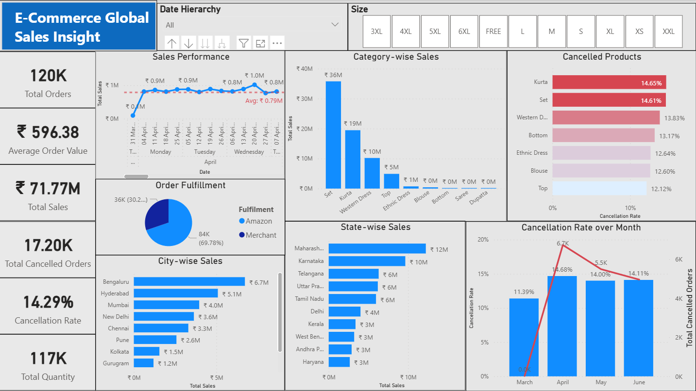

# E-Commerce Sales & Operations Analysis



## 📌 Project Overview
This project analyzes the sales and operations data of an e-commerce company to address key challenges such as stagnant revenue growth, high cancellation rates, and inventory management issues. By leveraging **Python** for data processing and **Power BI** for interactive dashboarding, this project provides actionable insights into financial performance, customer behavior, and logistics efficiency.

## 📂 File Structure
| File Name | Description |
| :--- | :--- |
| `E-Commerce Sustainable Growth.ipynb` | Jupyter Notebook containing Python code for data cleaning, EDA, and preprocessing. |
| `E-Commerce Growth Analysis.pbix` | Power BI dashboard file (.pbix) with interactive visuals and DAX measures. |
| `sales_dataset.zip` | Raw input dataset containing ~129,000 order records. |
| `fact_sales.csv` | Cleaned transaction table exported from Python (Fact Table). |
| `dim_products.csv` | Unique product details (SKU, Category, Size) exported from Python (Dimension Table). |
| `dim_locations.csv` | Unique shipping locations (City, State, Zip) exported from Python (Dimension Table). |
| `dashboard.png` | Static screenshot of the final Power BI dashboard. |

## 🛠️ Technologies Used
* **Python:** Pandas, NumPy, Matplotlib, Seaborn (Data Cleaning & Exploratory Analysis)
* **Power BI:** DAX, Data Modeling (Star Schema), Interactive Visualizations
* **Jupyter Notebook:** Development environment

## 📊 Methodology

### Step 1: Data Cleaning & Preprocessing (Python)
The raw dataset contained mixed date formats, null values, and inconsistent text casing. The `E-Commerce Sustainable Growth.ipynb` notebook handles:
* **Data Cleaning:** Handling missing values in the `Amount` column by imputing the median.
* **Standardization:** Parsing dates into a unified `YYYY-MM-DD` format and normalizing City/State names.
* **Star Schema Generation:** Splitting the single flat file into three normalized tables (`fact_sales`, `dim_products`, `dim_locations`) for efficient Power BI modeling.

### Step 2: Data Modeling & Visualization (Power BI)
The processed CSV files were imported into Power BI to create a **Star Schema** data model.
* **DAX Measures:** Calculated Key Performance Indicators (KPIs) such as *Total Revenue*, *Average Order Value (AOV)*, and *Cancellation Rate*.
* **Dashboarding:** Built a multi-section dashboard focusing on:
    1.  **Financial Performance:** Revenue trends and AOV analysis.
    2.  **Logistics:** Comparing "Amazon vs. Merchant" fulfillment performance.
    3.  **Customer Insights:** Geographic heatmaps of sales across India.
    4.  **Product Analysis:** Best-selling categories and SKU-level performance.

## 💡 Key Insights
* **Revenue Trend:** Revenue peaked in April 2022 (~₹26.3M) but saw a decline of ~18% by June, indicating a need for demand-generation initiatives.
* **Cancellation Rate:** A critically high cancellation rate of **14.2%** was observed.
* **Fulfillment Bottleneck:** Orders fulfilled by **Merchants** had a significantly higher cancellation rate (~17.5%) compared to Amazon-fulfilled orders (~12.8%).
* **Top Markets:** **Maharashtra** and **Karnataka** are the highest revenue-generating states, accounting for a significant portion of total sales.
* **Product Demand:** The business is heavily driven by **Kurtas** and **Sets**, which account for >60% of total volume.

## 🚀 How to Run
1.  **Clone the Repository:**
    ```bash
    git clone [https://github.com/yourusername/ecommerce-growth-analysis.git](https://github.com/yourusername/ecommerce-growth-analysis.git)
    ```
2.  **Python Analysis:**
    * Open `E-Commerce Sustainable Growth.ipynb` in Jupyter Notebook or VS Code.
    * Ensure `sales_dataset.csv` is in the same directory.
    * Run all cells to generate the cleaned CSV files.
3.  **Power BI Dashboard:**
    * Open `E-Commerce Growth Analysis.pbix` in Power BI Desktop.
    * *Note:* You may need to update the data source settings to point to the location of the CSV files on your local machine.

## 📬 Contact
If you have any questions or feedback, feel free to reach out!
* **LinkedIn:** [Your Name/Profile Link]
* **Email:** [Your Email]
